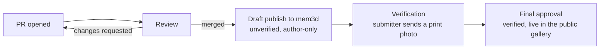

# mem3d.templates

Template source for [mem3d](https://mem3d.jonesie.kiwi) — kept independent
of the site's own repo (`~/dev/mem3d`) so templates can be authored,
reviewed and contributed by others without touching the app itself, and so
a template can sit as a draft indefinitely with zero risk of it going live
before it's ready.

Anyone can fork this repo and open a pull request with a new template or a
fix to an existing one — see [Contributing](CONTRIBUTING.md) for the
format and how to check your work, and [Review & publishing](#review--publishing)
below for what happens after you open the PR.

## Layout

- `templates/` — every template's `template.json` + mesh `.glb` file(s),
  one folder per id. This is the actual source of truth; nothing here is
  built from anything else in this repo except the procedural ones (below).
- `scripts/gen-templates.mts` — generates the procedural templates (most of
  them) with Manifold. `npm run gen`.
- `freecad-src/` — the FreeCAD-authored templates' source `.FCStd` files
  and their generator scripts (currently just `pet-tag`).
- `tools/freecad_export_template.py` — exports a FreeCAD document to
  `templates/<id>/` (`template.json` + mesh `.glb`), same as `gen` does for
  the procedural ones. Run inside FreeCAD or via FreeCADCmd.

## Workflow

1. Author or edit a template under `templates/<id>/` (via `npm run gen`,
   the FreeCAD export tool, or by hand) or a whole new template.
2. Leave `"published": false` in its `template.json` while it's a draft.
   The flag is only the author's note that it's ready or not: the
   maintainer's sync copies every template to the site either way, and the
   site decides visibility (it hides `"published": false` by default, and the
   admin's published setting in the site's database overrides that).
3. When it's ready: remove that flag (or set it `true`). No site rebuild,
   no container restart — the site's own `TemplateCatalogue` rescans on
   file mtime.
4. Commit. This repo is the history of what's been published and when,
   independent of the mem3d app's own commit history.

## Contributing

New templates and fixes come in as pull requests from forks — see
[CONTRIBUTING.md](CONTRIBUTING.md) for the `template.json` format, the
three ways to author one (procedural/Manifold, FreeCAD, or by hand), and
how to check your work before opening a PR. Publishing
is maintainer-only; just leave `"published": false` and open the PR.

## Review & publishing

Every submission goes through the same path:

Checks at each stage:

- **On the PR (public CI):** `npm run gen` (no mesh errors, committed
  templates match), `npm run check-schema` (`template.json` valid),
  `npm run stl-check` (meshes watertight, parts don't intersect).
- **Before publishing (maintainer, local):** check out the PR and run
  `npm run verify`. It runs the above plus the main mem3d repo's full
  `stl-check` (default text on every zone, every symbol, stroke
  printability) against this checkout. Set `MEM3D_REPO` if the main repo
  isn't at `~/dev/mem3d`.

1. **PR opened.** One template (or one focused fix) per PR, `"published": false`.
2. **Review.** I read through the PR — geometry, zone placement, notes —
   the same way I'd review any of my own additions, and merge it into
   `main` once it looks right (or ask for changes first).
3. **Unverified publish.** After merging, I publish it to the live
   site as unverified (`"verified"` unset/`false`). At this stage it's
   visible only to the GitHub account in the template's `"author"` field,
   not in the public gallery, so they can check it renders and exports
   correctly before anyone else sees it.
4. **Verification.** Once the submitter sends a photo of an actual print,
   I set `"verified": true` and publish again — from there it's live in
   the public gallery like any other template.

A template can also stay a draft indefinitely (step 1 only) with zero
risk of it reaching the site — see Workflow above.

## License

[CC BY-NC-SA 4.0](LICENSE) — share and remix freely with attribution,
noncommercial use only, derivatives stay under the same license.
